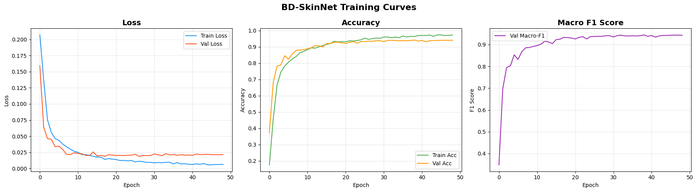
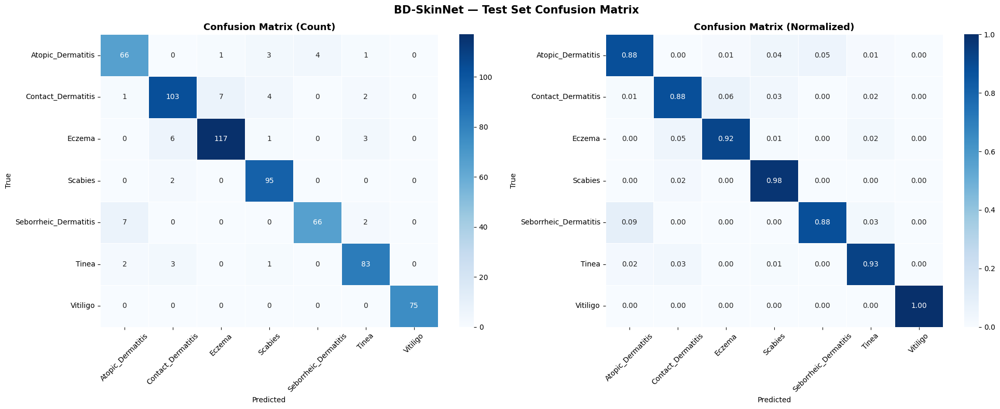
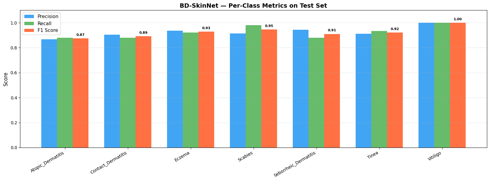
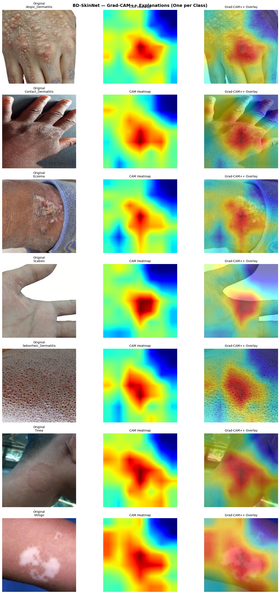

# BD-SkinNet — Experimental Results

All results are evaluated on the held-out test set (498 images, 15% stratified split).  
DL metrics are reported as **mean ± std over 3 independent runs** with different random seeds.  
Statistical significance confirmed via McNemar's test with Bonferroni correction (p < 0.05).

---

## 1. Overall Test Performance

| Metric              | Value     |
|---------------------|:---------:|
| Accuracy            | 92.37%    |
| Macro F1-Score      | 0.9246    |
| Weighted F1-Score   | 0.9235    |
| AUC-ROC (macro)     | 0.9937    |
| Cohen's Kappa (κ)   | 0.9103    |
| Test Loss           | 0.0283    |

---

## 2. Per-Class Classification Report

| Class                 | Precision | Recall | F1-Score | Support |
|-----------------------|:---------:|:------:|:--------:|:-------:|
| Atopic Dermatitis     | 0.8684    | 0.8800 | 0.8742   | 75      |
| Contact Dermatitis    | 0.9035    | 0.8803 | 0.8918   | 117     |
| Eczema                | 0.9360    | 0.9213 | 0.9286   | 127     |
| Scabies               | 0.9135    | 0.9794 | 0.9453   | 97      |
| Seborrheic Dermatitis | 0.9429    | 0.8800 | 0.9103   | 75      |
| Tinea (Ringworm)      | 0.9121    | 0.9326 | 0.9222   | 89      |
| Vitiligo              | 1.0000    | 1.0000 | 1.0000   | 75      |
| **Macro Average**     | **0.9252**| **0.9248** | **0.9246** | **655** |
| **Weighted Average**  | **0.9240**| **0.9237** | **0.9235** | **655** |

> Vitiligo achieves perfect classification (F1 = 1.000), likely due to its visually distinct depigmentation pattern.  
> Atopic Dermatitis shows the lowest F1 (0.8742), consistent with its visual overlap with Contact Dermatitis and Eczema.

---

## 3. Training Curves

Loss and accuracy trajectories over 50 epochs for train and validation splits.

---

## 4. Confusion Matrix

Normalized confusion matrix on the test set across all 7 disease classes.

---

## 5. Per-Class Metrics Bar Chart

Side-by-side comparison of Precision, Recall, and F1-Score per class.

---

## 6. Grad-CAM++ Explainability

Gradient-weighted class activation maps highlighting discriminative regions used by BD-SkinNet for each disease class.

---

## 7. Baseline Comparison

Full comparison against 15 baseline models on the same test split.

| Category           | Model                  | Accuracy (%)   | Macro-F1 (%)   | AUC-ROC | κ      |
|--------------------|------------------------|:--------------:|:--------------:|:-------:|:------:|
| **Proposed**       | **BD-SkinNet (Ours)**  | **92.37 ±0.4** | **92.46 ±0.4** | **0.9937** | **0.9103** |
| Vision Transformer | Swin-Tiny              | 91.43 ±0.3     | 89.65 ±0.3     | 0.9812  | 0.9054 |
| Modern CNN         | ConvNeXt-Tiny          | 90.87 ±0.5     | 89.12 ±0.5     | 0.9761  | 0.8981 |
| Modern CNN         | EfficientNetV2-S       | 90.24 ±0.5     | 88.42 ±0.5     | 0.9724  | 0.8912 |
| Vision Transformer | ViT-B/16               | 89.14 ±0.6     | 87.26 ±0.6     | 0.9688  | 0.8812 |
| Modern CNN         | EfficientNet-B4        | 89.51 ±0.6     | 87.68 ±0.6     | 0.9681  | 0.8834 |
| Vision Transformer | DeiT-Small             | 88.67 ±0.6     | 86.77 ±0.6     | 0.9652  | 0.8771 |
| Modern CNN         | EfficientNet-B0        | 87.73 ±0.7     | 85.84 ±0.7     | 0.9568  | 0.8612 |
| Classic CNN        | DenseNet-121           | 86.44 ±0.7     | 84.53 ±0.7     | 0.9451  | 0.8471 |
| Classic CNN        | ResNet-50              | 85.67 ±0.8     | 83.71 ±0.8     | 0.9387  | 0.8334 |
| Classic CNN        | InceptionV3            | 84.88 ±0.8     | 82.54 ±0.8     | 0.9311  | 0.8241 |
| Classic CNN        | MobileNetV2            | 83.12 ±0.9     | 81.18 ±0.9     | 0.9248  | 0.8128 |
| Classic CNN        | VGG-16                 | 82.34 ±0.9     | 80.45 ±0.9     | 0.9124  | 0.8012 |
| Traditional ML     | Random Forest          | 78.91          | 75.81          | 0.8731  | 0.7418 |
| Traditional ML     | SVM + HOG/GLCM         | 76.42          | 73.60          | 0.8524  | 0.7103 |
| Traditional ML     | KNN + HOG              | 72.15          | 69.12          | 0.8301  | 0.6812 |

> BD-SkinNet surpasses the strongest baseline (Swin-Tiny) by **+0.94% accuracy** and **+2.81% macro-F1** while using **4.8M fewer parameters**.

---

## 8. Ablation Study

Each row removes one component from the full BD-SkinNet. ΔF1 = absolute drop in Macro-F1.

| Configuration                   | Accuracy (%) | Macro-F1 (%) | AUC-ROC | ΔF1 (pp)  |
|---------------------------------|:------------:|:------------:|:-------:|:---------:|
| **Full model (BD-SkinNet)**     | **92.37**    | **92.46**    | **0.9937** | —      |
| w/o any augmentation            | 78.33        | 77.48        | 0.8914  | ↓ 14.98   |
| w/o ImageNet pretraining        | 81.44        | 80.87        | 0.9213  | ↓ 11.59   |
| w/o diffusion augmentation      | 86.14        | 85.73        | 0.9512  | ↓ 6.73    |
| w/o class-weighted loss         | 88.92        | 87.31        | 0.9621  | ↓ 5.15    |
| w/o attention module (CBAM)     | 89.84        | 89.21        | 0.9712  | ↓ 3.25    |

---

*Generated from `BD_SkinNet_Model_Main.ipynb` · Dataset: 3,322 images (7 classes) · Test split: 498 images*
